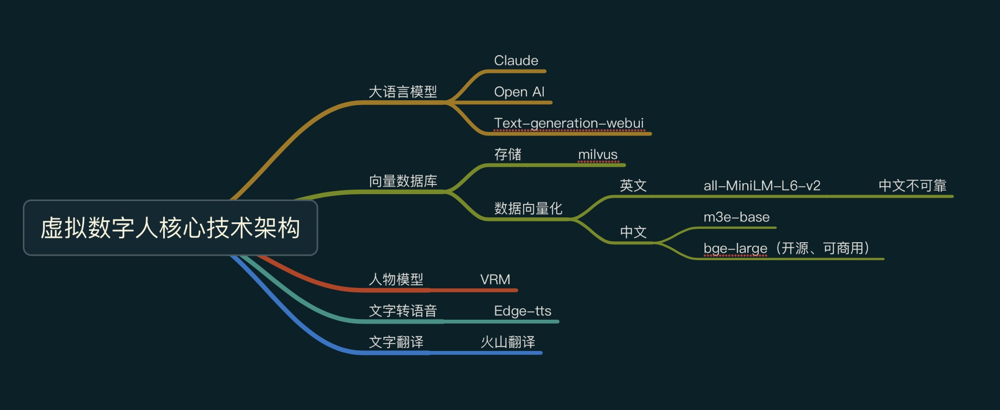
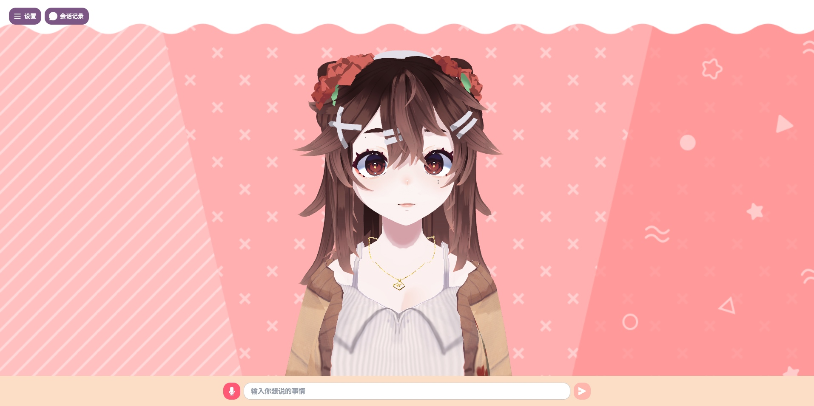
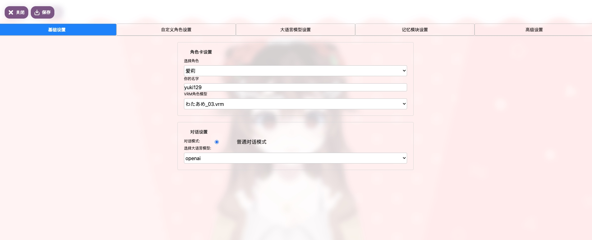
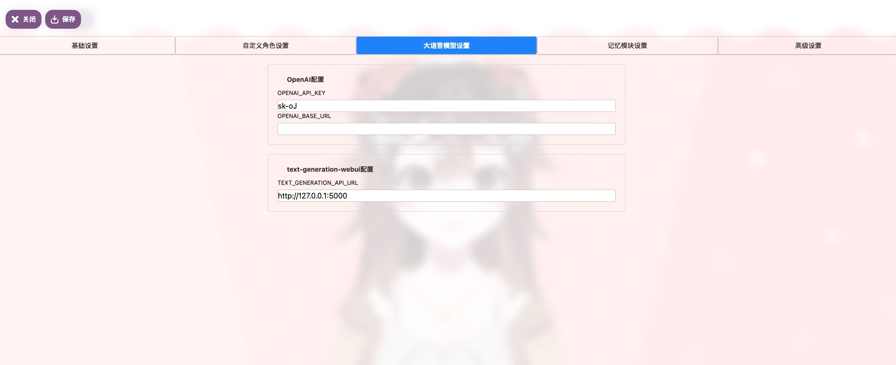
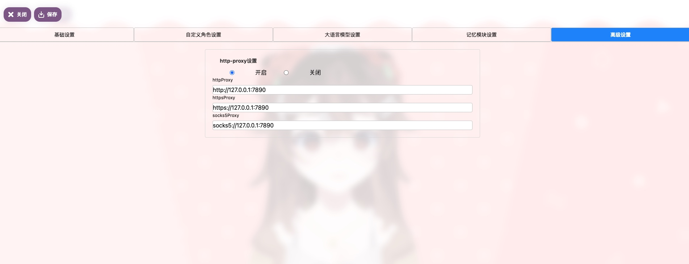
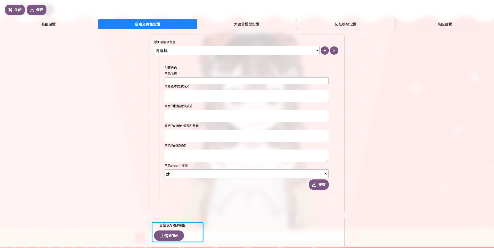
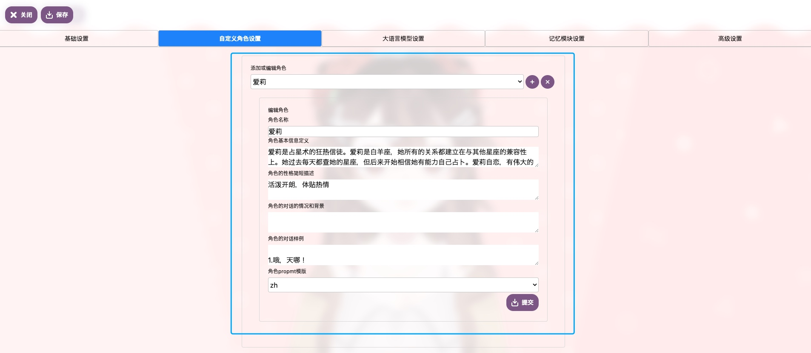
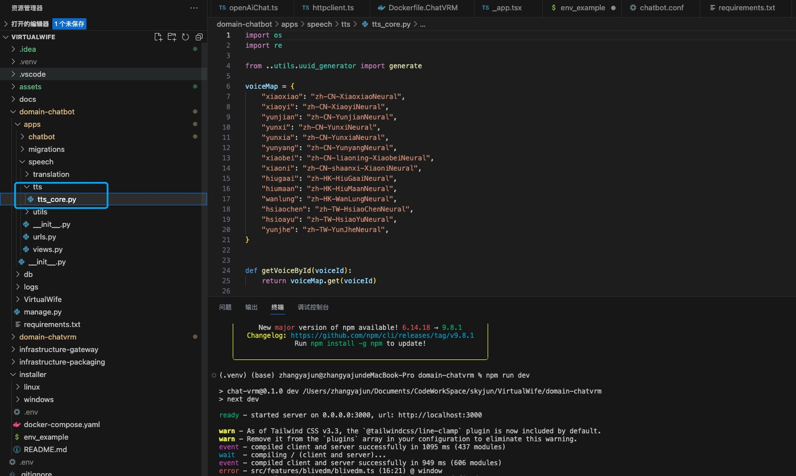

# VirtualWife

VirtualWife是一个虚拟数字人项目，项目还处于孵化阶段，会有很多需要优化的地方，作者想打造一个拥有自己“灵魂”的虚拟数字人，你可以像朋友一样和她相识，作者希望虚拟数字人融入人类生活，作为恋爱导师，心理咨询师，解决人类的情感需求。

> 一期项目的功能，暂时还没有完整开发完，在项目中遇到问题可以在群里@Alan或者提issue，欢迎大佬贡献自己想法和代码

## 项目一期核心功能说明


## 项目一期核心技术栈说明




## 项目结构说明

### 核心服务说明

- domain-chatbot: AI核心服务
- domain-chatvrm: VRM聊天客户端
- infrastructure-gateway: 基础设施-网关

### 环境要求

- python: 3.9.6
- node: 14.21.3

## 快速开始

### 安装[Docker](https://www.docker.com/)环境

- 方式一：命令行方式安装
    - [docker安装手册](https://www.runoob.com/docker/macos-docker-install.html)
    - [docker-compose安装手册](https://www.runoob.com/docker/docker-compose.html)
- 方式二：下载Docker桌面程序（桌面程序一般自带docker-compose）
    - [下载Docker桌面程序](https://www.docker.com/)
    - 然后下一步下一步就安装好了，如果拉取镜像比较慢，可以更改为国内镜像地址

- 检查是否安装成功，安装正常会打印日志
```
docker -v
docker-compose -v
```


### 进入VirtualWife安装程序目录

```
cd installer
```

```
├── README.md               # 安装程序使用说明
├── docker-compose.yaml     # docker编排文件
├── env_example             # 环境变量配置模版，使用时需要将文件名改成.env
├── linux                   # linux 启动和关闭程序
│   ├── start.sh
│   └── stop.sh
└── windows                 # windows 启动和关闭程序
    ├── start.bat
    └── stop.bat
```

### 设置环境变量

- 更改境变量配置模版文件名为.env
```
mv env_example .env
```
- 设置环境变量
```
# B站直播间ID（计划放在页面设置，目前有问题，暂时使用环境变量解决）
B_STATION_ID=27892212

# 时区
TIMEZONE=Asia/Shanghai

# 程序版本号，程序版本号可以查阅项目的release发布版本号，latest代表最新版本
CHATBOT_TAG=latest
CHATVRM_TAG=latest
GATEWAY_TAG=latest
```

### 启动程序

- 以Linux系统为例，启动程序示例如下
```
## 进入linux脚本目录
cd linux

## 启动程序，初次启动需要下载镜像，整个过程可能需要5分钟
sh start.sh
```

### 访问页面

- Web访问路径
```shell
http://localhost/
```
- 页面展示


### 初始化数字人配置

#### 基础配置
```
选择自己喜欢的角色和人物模型，并且选择大语言模型，如果是使用openai请将语言模型设置为openai
```


#### 大语言模型配置
```
这以openai模型为例，你只需要将OPENAI_API_KEY填写好即可，如果有API代理可以将地址填写到OPENAI_BASE_URL
```


#### 高级设置
```
如果没有OPENAI_BASE_URL，你需要配置http-proxy
```


#### 保存
保存、保存、保存，重要的事情说三遍


> 保存成功后，无需重启服务，可以开始聊天了

## 本地开发

### 如何启动domain-chatbot？

- 进入domain-chatbot文件夹
```shell
cd domain-chatbot
```
- 如何获取OpenAIKey?
    - https://platform.openai.com/overview
- 如何获取B站直播间ID？
    - 获取B站直播ID，前提是需要你自行注册B站直播用户

- 创建.env文件，添加B站直播间ID（计划放在页面设置，目前有问题，暂时使用环境变量解决）
```shell
# B站直播间ID
B_STATION_ID=xxxxx
```
- 安装domain-chatbot项目依赖
```shell
pip3 install -r requirements.txt
```
- 初始化项目数据库
```shell
python manage.py makemigrations 
```
```shell
python manage.py migrate 
```
- 启动domain-chatbot项目
```shell
python manage.py runserver
```
### 如何启动domain-chatvrm？

- 进入domain-chatvrm文件夹
```shell
cd domain-chatvrm
```
- 安装domain-chatvrm项目依赖
```shell
npm install
```
- 启动domain-chatvrm项目
```shell
npm run dev
```
- Web访问路径
```shell
http://localhost:3000/
```

### 如何在B站上进行直播呢？

作者是Mac系统，使用OBS进行直播，具体直播布置教程，可以参考以下视频
- [新手MacBook直播OBS教程](https://www.bilibili.com/video/BV1aB4y1P7BK/?spm_id_from=333.999.0.0)

### 如何更换VRM模型呢？

- VRM模型市场：[Vroid](https://hub.vroid.com/)
- 点击设置后，点击打开VRM模型按钮，上传VRM（这块作者还没优化，刷新页面会加载默认模型）


### 如何更换虚拟AI的prompt？

- 新增角色，提交后可以在基础设置中选择你的角色


### 如何更换中文语音包？
- 本系统已经内置了很多中文语音包


## 技术交流群


