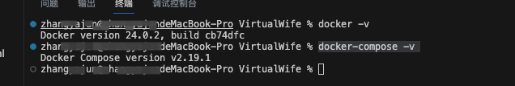

# VirtualWife

VirtualWife 是一个虚拟主播项目，目前支持在B站进行直播，用户可以自由更换VRM人物模型，大家可以将他作为一个虚拟主播入门demo，在上面扩展自己喜欢功能。

本项目只是一个实验品，满足基本聊天能力，用户可以通过弹幕与虚拟主播进行对话

## 项目技术栈说明

- React：前端服务框架
- Django：后端服务框架
- LangChain: 支撑聊天核心功能
- OpenAI: GPT大语言模型 
- Edge-tts: 微软语音合成模型
- VRM: VRM人物模型

## 项目结构说明

### 核心服务说明

- domain-chatbot: AI核心服务
- domain-chatvrm: 聊天客户端
- infrastructure-gateway: 基础设施-网关

### 环境要求

- python: 3.9.6
- node: 14.21.3

## 快速开始

### 安装[Docker](https://www.docker.com/)环境

- 方式一：命令行方式安装
    - [docker安装手册](https://www.runoob.com/docker/macos-docker-install.html)
    - [docker-compose安装手册](https://www.runoob.com/docker/docker-compose.html)
- 方式二：下载Docker桌面程序（桌面程序一般自带docker-compose）
    - [下载Docker桌面程序](https://www.docker.com/)
    - 然后下一步下一步就安装好了，如果拉取镜像比较慢，可以更改为国内镜像地址

- 检查是否安装成功，安装正常会打印日志
```
docker -v
docker-compose -v
```


### 进入VirtualWife安装程序目录

```
cd installer
```

```
├── README.md               # 安装程序使用说明
├── docker-compose.yaml     # docker编排文件
├── env_example             # 环境变量配置模版，使用时需要将文件名改成.env
├── linux                   # linux 启动和关闭程序
│   ├── start.sh
│   └── stop.sh
└── windows                 # windows 启动和关闭程序
    ├── start.bat
    └── stop.bat
```

### 设置环境变量

- 更改境变量配置模版文件名为.env
```
mv env_example .evn
```
- 设置环境变量
```
# OpenAI Key
OPENAI_API_KEY=sk-XXXXX

# B站直播间ID
B_STATION_ID=27892212

# 时区
TIMEZONE=Asia/Shanghai

# 程序版本号，程序版本号可以查阅项目的release发布版本号，latest代表最新版本
CHATBOT_TAG=latest
CHATVRM_TAG=latest
GATEWAY_TAG=latest
```

### 启动程序

- 以Linux系统为例，启动程序示例如下
```
## 进入linux脚本目录
cd linux

## 启动程序，初次启动需要下载镜像，整个过程可能需要5分钟
sh start.sh
```

### 访问页面

- Web访问路径
```shell
http://localhost/
```
- 页面展示


## 本地开发

### 如何启动domain-chatbot？

- 进入domain-chatbot文件夹
```shell
cd domain-chatbot
```

- 如何获取OpenAIKey?
    - https://platform.openai.com/overview

- 如何获取B站直播间ID？
    - 获取B站直播ID，前提是需要你自行注册B站直播用户

- 创建.env文件，添加OpenAIKey和B站直播间ID
```shell
# OpenAIKey
OPENAI_API_KEY=xxxxxx
# B站直播间ID
B_STATION_ID=xxxxx
```
- 安装domain-chatbot项目依赖
```shell
pip3 install -r requirements.txt
```
- 启动domain-chatbot项目
```shell
python manage.py runserver
```

### 如何启动domain-chatvrm？

- 进入domain-chatvrm文件夹
```shell
cd domain-chatvrm
```
- 安装domain-chatvrm项目依赖
```shell
npm install
```
- 启动domain-chatvrm项目
```shell
npm run dev
```
- Web访问路径
```shell
http://localhost:3000/
```

### 如何在B站上进行直播呢？

作者是Mac系统，使用OBS进行直播，具体直播布置教程，可以参考以下视频
- [新手MacBook直播OBS教程](https://www.bilibili.com/video/BV1aB4y1P7BK/?spm_id_from=333.999.0.0)

### 如何更换VRM模型呢？

- VRM模型市场：[Vroid](https://hub.vroid.com/)
- 点击设置后，点击打开VRM模型按钮，上传VRM（这块作者还没优化，刷新页面会加载默认模型）


### 如何更换虚拟AI的prompt？

- 默认使用虚拟主播爱莉的prompt


- 训练自己的prompt，可以参照爱莉的prompt迭代自己的虚拟人物

### 如何更换中文语音包？

- 本系统已经内置了很多中文语音包


## 后记

本项目是作者第一次接触数字人开发的实验型demo，基于[ChatVRM](https://github.com/pixiv/ChatVRM)+Edge-tts+LangChain+OpenAI实现，希望能通过这个项目让大家快速搭建自己的虚拟主播，如果项目对你有用，可以帮忙点个start，优化建议、bug可以提issues

## 技术交流群


