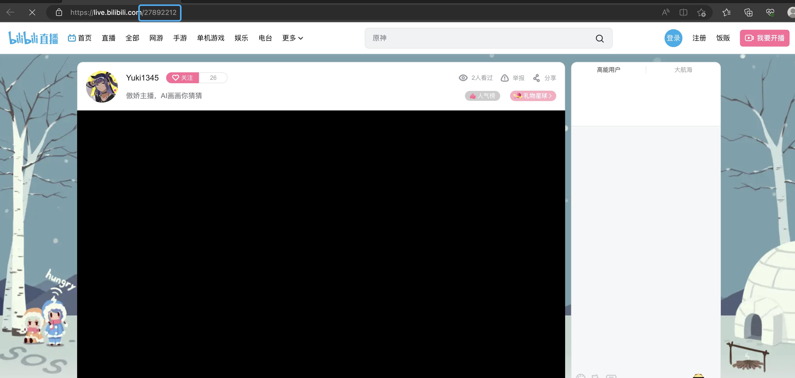

## 本地开发

### 环境要求

- python: 3.10.12
- node: 15.14.0

### 先决条件
- 安装conda，在Linux或WSL上，可以使用以下两个命令自动安装它（源代码）
  - 其他安装方式：[anaconda](https://anaconda.org.cn/anaconda/install/windows/)
```shell
curl -sL "https://repo.anaconda.com/miniconda/Miniconda3-latest-Linux-x86_64.sh" > "Miniconda3.sh"
bash Miniconda3.sh
```
- 初始化环境
```shell
conda create -n vw python=3.10.12
conda activate vw
conda install -c conda-forge nodejs=15.14.0
```

### 如何启动domain-chatbot？

- 进入domain-chatbot文件夹
```shell
cd domain-chatbot
```
- 如何获取OpenAIKey?
    - https://platform.openai.com/overview
- 如何获取B站直播间ID？
    - 获取B站直播ID，前提是需要你自行注册B站直播用户

- 安装domain-chatbot项目依赖
```shell
pip3 install -r requirements.txt -i https://pypi.tuna.tsinghua.edu.cn/simple some-package
```
- 初始化项目数据库
```shell
python manage.py makemigrations 
```
```shell
python manage.py migrate 
```
- 启动domain-chatbot项目
```shell
python manage.py runserver
```
### 如何启动domain-chatvrm？

- 进入domain-chatvrm文件夹
```shell
cd domain-chatvrm
```
- 安装domain-chatvrm项目依赖
```shell
npm config set registry https://registry.npmmirror.com
rm package-lock.json
npm install
```
- 启动domain-chatvrm项目
```shell
npm run dev
```
- Web访问路径
```shell
http://localhost:3000/
```

